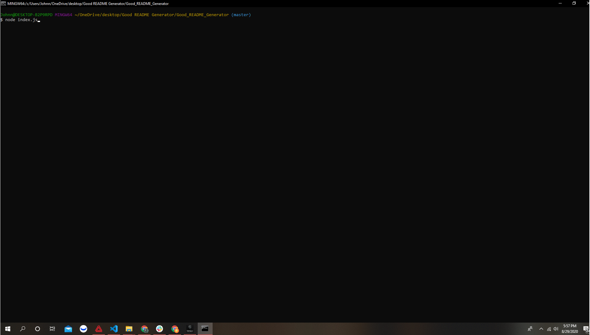

# README Generator

## Table of Contents

* [Installation](#installation)
* [Summary](#summary)
* [Usage](#usage)
* [History](#history)
* [Credits](#credits)
* [License](#license)

## Installation

* Download my "Develop" folder in its entirety.
* Using GitBash, navigate to this folder on your desktop.
* Use command "code .." in GitBash without the quatations.

## Summary

This program asks the user a series of questions then takes the answers and generates a README.md file for the user.

## Usage

* This is strictly for educational purposes.

## History

https://github.com/johnnylieu/Good_README_Generator/commits/master

## Credits

* I want to thank my tutor Bobbi Tarkany for helping me with the finishing touches.
* Shields.io
* https://choosealicense.com/

## License
 
* © 2019 Trilogy Education Services, a 2U, Inc. brand. All Rights Reserved.
* © UCSD Coding Bootcamp
